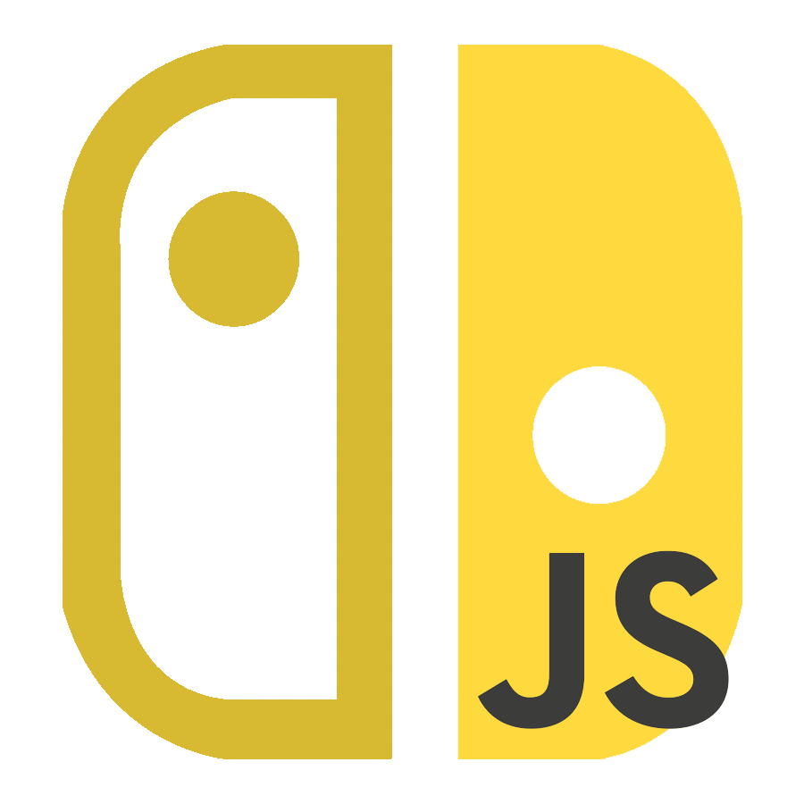

# nx.js



**nx.js** is a framework that enables the development of Nintendo Switch
homebrew applications using JavaScript. Powered by the [QuickJS][QuickJS]
engine, nx.js provides a streamlined environment for writing homebrew
applications for the Nintendo Switch console.

With nx.js, developers can leverage their JavaScript skills and tools to create
engaging and interactive experiences for the Nintendo Switch platform. The
framework abstracts the underlying low-level details and provides a high-level
JavaScript API that simplifies the development process.

nx.js is designed with Web standards in mind, so familiar APIs like
`setTimeout()`, `fetch()`, `new URL()`, `Canvas` and much more are supported. If
you are familar with web development then you should feel right at home.

## Features

- **JavaScript Development**: Write homebrew applications for the Nintendo
  Switch using JavaScript, a popular and widely supported programming language.
- **High-Level API**: Benefit from a high-level JavaScript API designed
  specifically for the Nintendo Switch platform, providing easy access to
  console-specific features and functionality.
- **Input Handling**: Capture and process user input with ease, including
  buttons, touch screen, and motion controls, to create engaging gameplay
  experiences.
- **Graphics and UI**: Create visually appealing and interactive user interfaces
  using the web
  [`Canvas`](https://developer.mozilla.org/docs/Web/API/Canvas_API) API.
- **Audio Support**: Integrate audio playback and sound effects into your
  applications using the web
  [`Audio`](https://developer.mozilla.org/docs/Web/API/HTMLAudioElement/Audio)
  API.
- **WebAssembly**: Support for executing code compiled to
  [WebAssembly (WASM)](https://developer.mozilla.org/docs/WebAssembly).

## Getting Started

Please see the [Getting Started](https://nxjs.n8.io/runtime) guide.

## Contributing

Contributions to nx.js are welcome! If you find any issues or have suggestions
for improvements, please open an issue or submit a pull request in the
[GitHub repository](https://github.com/TooTallNate/nx.js).

[**Join the Discord server!**](https://discord.gg/MMmn73nsGz)

### Building from Source

1. Node.js needs to be installed
   (`curl -sfLS install-node.vercel.app/20 | bash`)
1. `pnpm` needs to be installed (`npm i -g pnpm`)
1. `jq` needs to be installed (`brew install jq`)
1. The [devkitPro](https://devkitpro.org/) compiler toolchain needs to be
   installed
1. Install required packages from the official registry:
   ```bash
   sudo dkp-pacman -S switch-dev switch-freetype switch-libjpeg-turbo switch-libpng switch-harfbuzz switch-libwebp switch-libzstd switch-mbedtls
   ```
1. Install additional packages which are not in the official registry (cairo,
   pixman, wasm3, harfbuzz, quickjs-ng):
   ```bash
   docker pull ghcr.io/tootallnate/pacman-packages:nxjs
   docker run -it --rm --platform linux/amd64 --mount type=bind,source="$(pwd)",target=/host ghcr.io/tootallnate/pacman-packages:nxjs sh -c 'cp packages/*/*.pkg.tar.zst /host'
   sudo dkp-pacman -U *.pkg.tar.zst
   ```
1. `qjsc` needs to be installed (**note**: must match the version of the QuickJS
   dkp package installed in the previous step, see [here](https://github.com/TooTallNate/pacman-packages/blob/nxjs/Dockerfile#L80))
1. Now you can compile one of the example apps into a self-contained `.nro`:
   ```bash
   ./build.sh hello-world
   ```

## License

nx.js is released under the MIT License. Please see the [`LICENSE`](./LICENSE)
file for more details.

[QuickJS]: https://bellard.org/quickjs/
