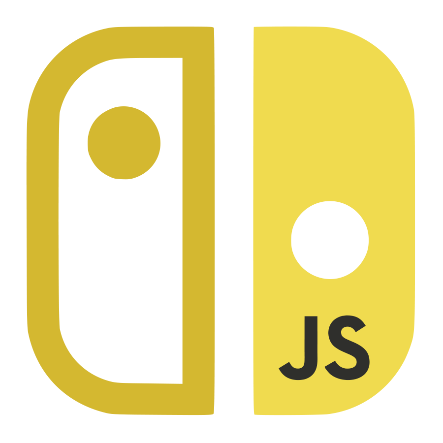

# nx.js



**nx.js** is a framework that enables the development of Nintendo Switch
homebrew applications using JavaScript. Powered by the [V8][] JavaScript engine
(the same engine as Chrome and Node.js), nx.js provides a streamlined
environment for writing homebrew applications for the Nintendo Switch console.

With nx.js, developers can leverage their JavaScript skills and tools to create
engaging and interactive experiences for the Nintendo Switch platform. The
framework abstracts the underlying low-level details and provides a high-level
JavaScript API that simplifies the development process.

nx.js is designed with Web standards in mind, so familiar APIs like
`setTimeout()`, `fetch()`, `new URL()`, `Canvas`, `WebGL2`, Web Audio, Web
Bluetooth and much more are supported. If you are familiar with web development
then you should feel right at home.

## Features

- **JavaScript Development**: Write homebrew applications for the Nintendo
  Switch using JavaScript or TypeScript, a popular and widely supported
  programming language.
- **High-Level API**: Benefit from a high-level JavaScript API designed
  specifically for the Nintendo Switch platform, providing easy access to
  console-specific features and functionality.
- **Input Handling**: Capture and process user input with ease, including
  buttons, touch screen, and motion controls, to create engaging gameplay
  experiences.
- **Graphics and UI**: Create visually appealing and interactive user interfaces
  using the web
  [`Canvas`](https://developer.mozilla.org/docs/Web/API/Canvas_API) API,
  GPU-accelerated by the [Skia](https://skia.org/) 2D graphics library.
- **3D Graphics**: Render hardware-accelerated 3D graphics with the
  [`WebGL2`](https://developer.mozilla.org/docs/Web/API/WebGL2RenderingContext)
  API, backed by a real OpenGL ES 3 context on the Switch GPU.
- **Audio & Video**: Play audio and video files with the web
  [`Audio`](https://developer.mozilla.org/docs/Web/API/HTMLAudioElement/Audio)
  and `Video` elements, plus the full
  [Web Audio API](https://developer.mozilla.org/docs/Web/API/Web_Audio_API),
  backed by an [FFmpeg](https://ffmpeg.org/) media pipeline.
- **Bluetooth**: Communicate with Bluetooth Low Energy peripherals using the
  [Web Bluetooth](https://developer.mozilla.org/docs/Web/API/Web_Bluetooth_API)
  GATT client API.
- **WebAssembly**: Support for executing code compiled to
  [WebAssembly (WASM)](https://developer.mozilla.org/docs/WebAssembly).

## Getting Started

Please see the [Getting Started](https://nxjs.n8.io/runtime) guide.

## Contributing

Contributions to nx.js are welcome! If you find any issues or have suggestions
for improvements, please open an issue or submit a pull request in the
[GitHub repository](https://github.com/TooTallNate/nx.js).

[**Join the Discord server!**](https://discord.gg/MMmn73nsGz)

### Building from Source

> [!NOTE]
> nx.js is cross-compiled for the Switch's `aarch64` CPU using the
> [devkitPro](https://devkitpro.org/) toolchain, so a full build can only be
> done on a machine with devkitPro installed (Linux, macOS, or WSL). You do
> **not** need to build from source to develop apps — see the
> [Getting Started](https://nxjs.n8.io/runtime) guide, which uses the published
> runtime.

1. Node.js needs to be installed
   (`curl -sfLS install-node.vercel.app/22 | bash`)
1. `pnpm` needs to be installed (`npm i -g pnpm`)
1. `jq` needs to be installed (`brew install jq`)
1. The [devkitPro](https://devkitpro.org/) compiler toolchain needs to be
   installed
1. Install required packages from the official registry:
   ```bash
   sudo dkp-pacman -S switch-dev switch-freetype switch-libjpeg-turbo switch-libpng switch-harfbuzz switch-libwebp switch-libzstd switch-mbedtls switch-ffmpeg
   ```
1. Install the additional custom packages which are **not** in the official
   devkitPro registry (`switch-v8`, `switch-skia`, `switch-libuv`,
   `switch-ada`, `switch-dav1d`, and others). These are distributed via a
   Docker image:
   ```bash
   docker pull ghcr.io/tootallnate/pacman-packages:nxjs
   docker run -it --rm --platform linux/amd64 --mount type=bind,source="$(pwd)",target=/host ghcr.io/tootallnate/pacman-packages:nxjs sh -c 'cp packages/*/*.pkg.tar.zst /host'
   sudo dkp-pacman -U *.pkg.tar.zst
   ```
1. Now you can compile one of the example apps into a self-contained `.nro`:
   ```bash
   ./build.sh hello-world
   ```

> [!TIP]
> The `build.sh` script bundles the TypeScript runtime, compiles the native
> `nxjs.nro` runtime via `make`, and packages the selected example app from the
> [`apps/`](./apps) directory into a standalone `.nro`.

## License

nx.js is released under the MIT License. Please see the [`LICENSE`](./LICENSE)
file for more details.

[V8]: https://v8.dev/
